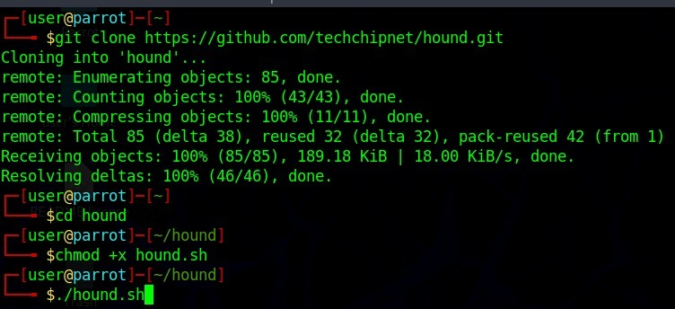
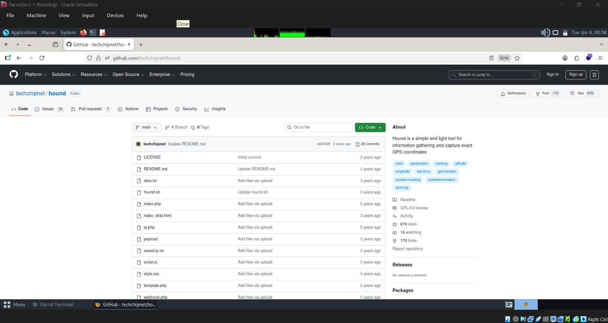

  <h1>Day - 5 of CEH</h1>

 # Footprinting & Reconnaissance

 ---

# Footprinting

- Footprinting is the process of gathering information about a target **system, network, or organization**.
- It helps understand the **structure of the target** and identify **potential points of entry**.
- Footprinting is the **first step of ethical hacking**.
- It involves collecting information about:
  - Systems
  - Networks
  - Security posture of the organization

  

  

---

## Types of Footprinting

Footprinting is classified into the following two types:

  

### 1. Passive Footprinting
- Information is collected **without directly interacting** with the target system or network.
- Uses **publicly available sources**.
- Difficult to detect.

**Examples:**
- Reviewing the organization’s official website
- Collecting information from search engines

---

### 2. Active Footprinting
- Involves **direct interaction** with the target system or network.
- Provides **more accurate technical details**.
- More likely to be detected by security systems.

**Example:**
- Using **social engineering techniques** to interact with employees and obtain organizational or technical information

---

## Footprinting Methodologies

### 1. Footprinting Through Web Services
- Uses publicly accessible online services.
- Reveals:
  - Domain information
  - IP address ranges
  - Subdomains
  - Hosting providers
- Helps understand the organization’s **online presence and technology stack**.

---

### 2. Footprinting Through Social Networking Sites
- Gathers information from social media platforms.
- Identifies:
  - Employee names
  - Job roles
  - Locations
  - Technologies used
  - Organizational hierarchy
- Supports **social engineering analysis**.

---

### 3. Website Footprinting
- Analyzes the organization’s official website.
- Identifies:
  - Server details
  - Application frameworks
  - Directories
  - Links
  - Content disclosures
- Helps understand website structure and technologies.

---

### 4. Email Footprinting
- Collects information related to the email system.
- Includes:
  - Email addresses
  - Email formats
  - Mail servers
  - Security mechanisms
- Reveals internal communication structure.

---

### 5. WHOIS Footprinting
- Queries WHOIS databases.
- Retrieves:
  - Domain ownership
  - Registrar details
  - Registration and expiration dates
  - Administrative and technical contacts
- Helps identify key organizational and network details.

---

## Information Obtained in Footprinting

### 1. Network Information
- Details related to network infrastructure.
- Includes:
  - IP address ranges
  - Network blocks
  - Domain names
  - DNS records
  - Subdomains
  - Network topology
  - Routing information
  - Internet Service Providers (ISP)

---

### 2. System Information
- Details about hardware and software systems.
- Includes:
  - Operating systems
  - Servers
  - Applications
  - Web servers
  - Databases
  - Security mechanisms
- Helps identify technologies and vulnerabilities.

---

### 3. Organizational Information
- Details about organizational structure.
- Includes:
  - Employees
  - Departments
  - Job roles
  - Email formats
  - Physical locations
  - Business operations
  - Internal policies
- Useful for hierarchy analysis and social engineering.

---

## Ping Command

### Purpose
- Checks the **reachability** of a target host.
- Determines whether the system is **alive**.
- Helps identify **active hosts** and network latency.

---

### Information Obtained Using Ping
- Whether the target system is online
- Round-trip time
- Packet loss
- Network connectivity status 

---

### Steps
- **Step 1:** Open Terminal
- **Step 2:** type
ping <target>

  

-

## Footprinting Tools and Services

### 1. Wappalyzer 

  

- Identifies technologies used on a website.
- Detects:
  - Web servers
  - CMS
  - Frameworks
  - Programming languages
  - Analytics tools
- Used in website footprinting.

  

  - we can see the detals of technologies used in a particular website.
  - for example i have taken microsoft.com

  

  

---

### 2. WHOIS Database 

- Public repository of domain and IP registration details.
- Contains:
  - Domain owner
  - Registrar
  - Registration and expiration dates
  - Administrative contacts 
  

  

  - we can use whois command in terminal also
  - open terminal and type "whois <databasename>"
  - we can see the database details in terminal

  

  

  

---

### 3. WHOIS Lookup
- Process of querying the WHOIS database.
- Retrieves:
  - Ownership information
  - Domain age
  - Registrar details
  - Contact records 

---

### 4. Fake Name Generator

  

 

- Generates synthetic personal identities.
- Includes:
  - Name
  - Address
  - Email
  - Phone number
- Used for testing and privacy protection.

  

---

### 5. This Person Does Not Exist
- Generates AI-created realistic human faces.
- Images do not belong to real individuals.
- Demonstrates digital identity simulation.

  

---

### 6. Grabify
- Generates trackable links.
- Collects:
  - IP address
  - Browser type
  - Operating system
  - Approximate location
- Demonstrates information leakage through interaction.

  

---

### 7. IP Lookup
- Retrieves geographical and network details of an IP address.
- Provides:
  - Country
  - Region
  - ISP
  - Organization information

---

### 8. I Know What You Download
- Displays publicly visible torrent activity linked to an IP address.
- Shows:
  - File names
  - Download timestamps
  - Torrent hashes
- Uses public BitTorrent tracking data.
- Does not directly identify individuals.
- Demonstrates privacy risks of public data exposure.

  

---

## Hound Tool Installation and Execution 

### Step 1: Search for hound in the browser

  

- Open **Terminal** from the Applications menu  
  

### Step 2: Clone the Hound Repository

git clone https://github.com/techchipnet/hound.git

### Step 3: Navigate to the Hound Directory

cd hound

### Step 4: Give Execute Permission
chmod +x hound.sh

Grants permission to execute the Hound script

  

### Step 5: Run the Hound Tool
./hound.sh

Executes the Hound tool.
The tool is now ready for use in information gathering.

  

