

  <h1>Day - 7 of CEH</h1>

# OSINT & Reconnaissance

---

## 1. Censys
- **Purpose**: Alternative to Shodan for discovering internet-connected devices.
- **Censys GPT**:
  - Helps build and extract search filters.
  - Identifies devices/services in a specific region.
  

  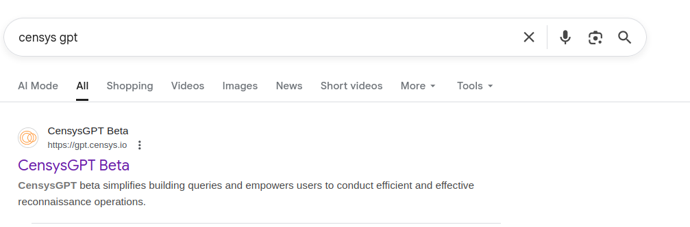

- **Workflow**:
  - Select a filter (e.g., cameras in a country).
  - Copy the generated filter/query.
  - Paste it into the Censys search bar.
  

  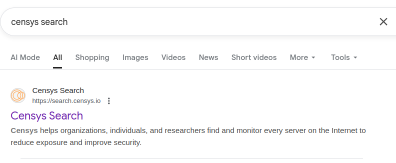

###  //Censys Login Process//
---
### Step 1: Open Browser
- Open Firefox (or any browser)

### Step 2: Go to Censys Website
- Type the following URL in the address bar:
  https://search.censys.io

### Step 3: Click on Login
- On the top-right corner, click **Log In**

### Step 4: Choose Login Method
- You can log in using:
  - Email and password
  - Google account
  - GitHub account

### Step 5: Enter Credentials
- Enter your registered email and password
- Click **Log In**

### Step 6: Verify Email (If New User)
- Check your email inbox
- Click the verification link sent by Censys

### Step 7: Access Censys Dashboard
- After successful login, you will be redirected to the Censys dashboard
- You can now search for:
  - Hosts
  - IP addresses
  - Domains
  - Certificates

### Step 8: Start Searching
- Use the search bar to apply filters
- Example:
  services.http.response.status_code:200

---

## 2. Infoga (Email OSINT)
- **Purpose**: Collects publicly available email information related to a domain.
- **Source**: GitHub repository.

  

- **Basic Steps**:
  - Clone the repository.
  - Navigate to the Infoga directory.
  - View help options.
  - Run against a target domain.
- **Use Case**:
  - Finding emails indexed by search engines.

## Infoga Setup on Parrot OS (Complete Steps)

### Step 1: Open Firefox, search for Infoga GitHub, and copy the repository link

  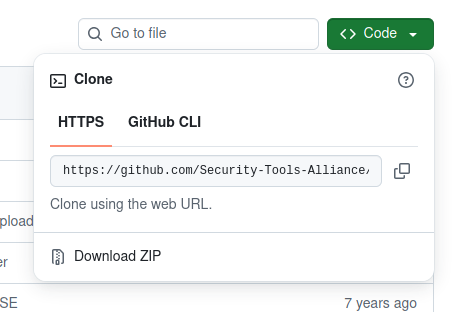

### Step 2: Clone Infoga from GitHub
- command: git clone https://github.com/m4ll0k/Infoga.git

  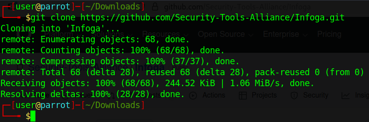

### Step 3: Enter Infoga directory
- command: cd Infoga

  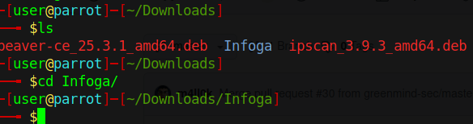

### Step 4: Verify installation and view help menu
- command: python3 infoga.py --help

  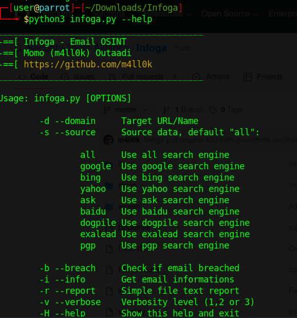

### Step 5: Run Infoga on a target domain
- command: python3 infoga.py -d example.com -s all

  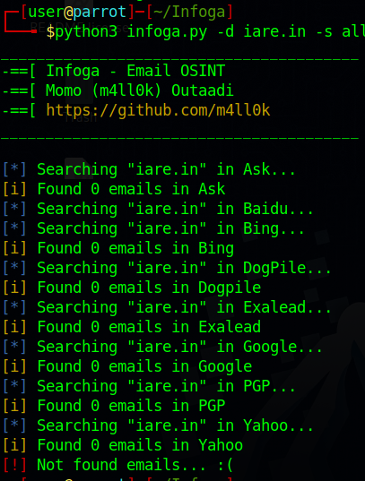

---

## 3. Search Engine Dorking
### General Rules
- Use quotes (`" "`) for exact phrase matching.
- Combine operators to narrow search results.

### Common Operators
- `site:` – Restricts results to a specific website  
  - Example: `site:example.com`
  

  

- `inurl:` – Searches keywords in URLs  
  - Example: `inurl:login`
- `filetype:` – Searches for specific file types  
  - Example: `filetype:pdf`
  

  

### Examples
- Academic sites: `site:.ac.in`, `site:.edu`
- Government sites: `site:.gov`, `site:.gov.in`
- Job listings: `site:company.com jobs`

> ⚠️ Use only for educational or authorized purposes.

---

## 4. Wayback Machine (archive.org)
- **Purpose**: View historical versions of websites.

  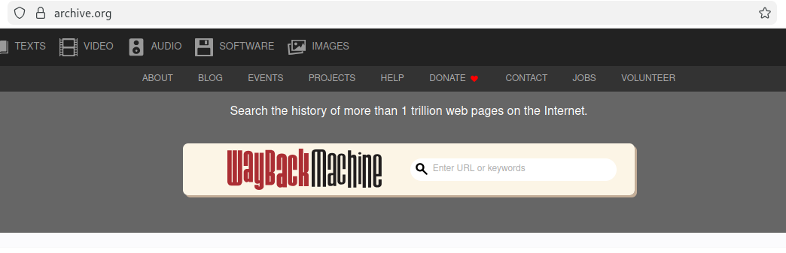

- **Steps**:
  - Copy the website URL.
  - Paste it into archive.org.
  - Browse snapshots using the timeline.
  

  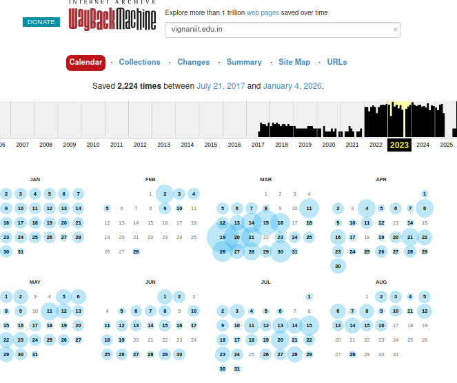

---

## 5. Subdomains
- **Definition**: A subdomain is part of a larger domain name.
- **Purpose**:
  - Organizes different sections of a website.

### Example
- https://photos.example.org
- `photos` → Subdomain (third-level domain)
- `example` → Domain name
- `.org` → Top-level domain (TLD)

---

## 6. Subdomain Enumeration Tools
### Sublist3r
- Discovers subdomains of a target domain.
- Installed via package manager.
- Displays discovered subdomains.

  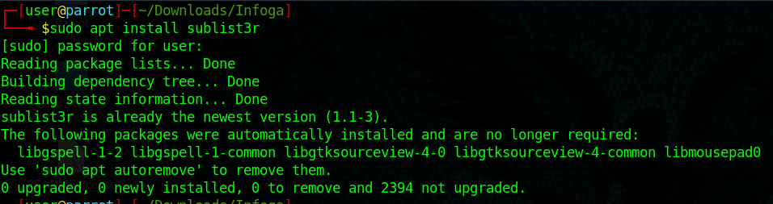

  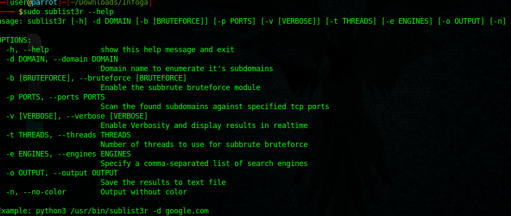

# Sublist3r Setup on Parrot OS 

 ### Step 1: Open Firefox, search for Sublist3r GitHub, and copy the repository link

 ### Step 2: Clone Sublist3r from GitHub
- Command: git clone https://github.com/aboul3la/Sublist3r.git

 ### Step 3: Enter Sublist3r directory
- Command: cd Sublist3r

### Step 5: Verify installation and view help menu
- Command: python3 sublist3r.py -h

### Step 6: Run Sublist3r on a target domain
- Command:python3 sublist3r.py -d example.com

### Netcraft
- Online tool for subdomain and hosting discovery.

  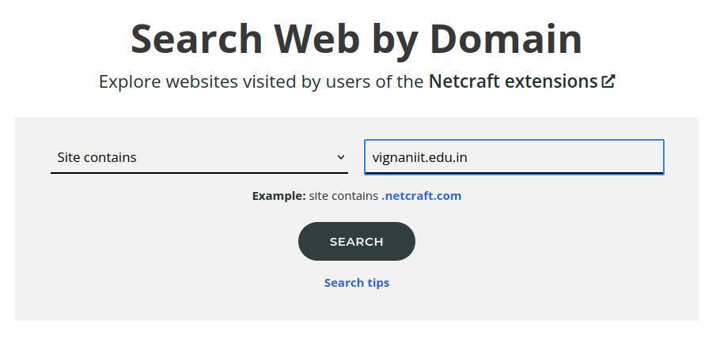

  

---

## 7. OSINT Tools & Databases
- **Exploit Database**:
  - Public vulnerability reference database.
- **GHDB (Google Hacking Database)**:
  - Collection of advanced Google dorks.
  

  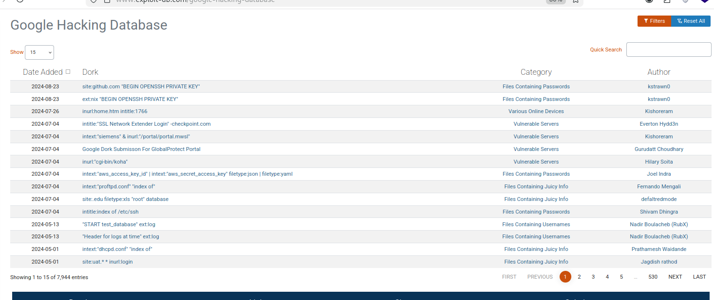

- **DorkGPT**:
  - AI-assisted dork/query generator.
  

  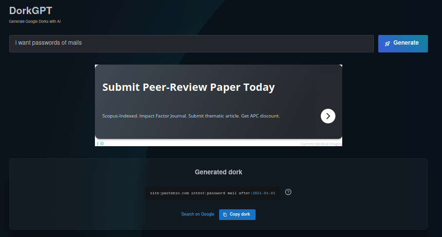

---

## 8. People Search Tools
### Spokeo

  

- Gathers public information about individuals.
- Mostly paid.
- Primarily works for U.S. citizens.

  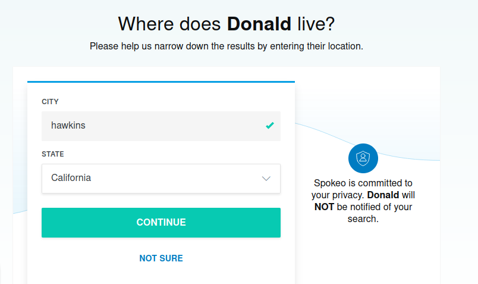

  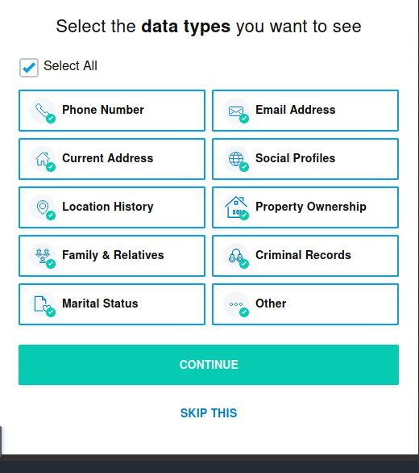

---

## 9. Command-Line Basics
- `pip` – Installs Python libraries.
- `apt` – Installs system packages on Debian-based systems.

---

## 10. GPT-based CLI Tools
### ShellGPT / TGPT
- Command-line tools using GPT models.

  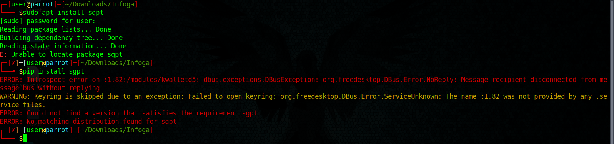

- Example use cases:
  - Mathematical calculations.
  - Finding public IP address.
  - Generating WHOIS or port-scan explanations (theoretical).
 

  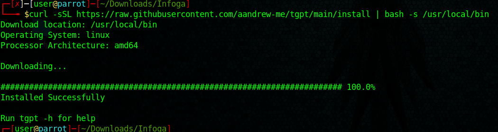

pt is a command-line tool that lets you use ChatGPT directly from the Linux terminal (Parrot OS, Kali Linux, Ubuntu, etc.).

When you run:

**tgpt --help**
(or sometimes tgpt help)

it shows:

How to use the tgpt command

Available options and flags

Examples of common usage

In short, tgpt help explains how to use tgpt.

  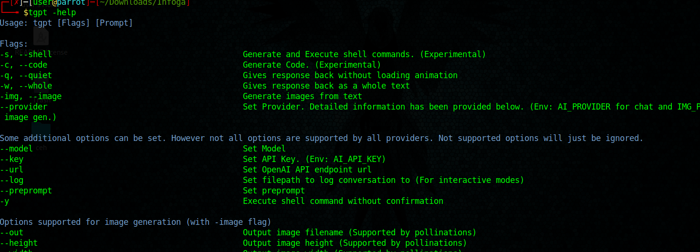

> ⚠️ Always follow ethical and legal guidelines. Perform scans or reconnaissance only on systems you own or have permission to test.

---