

  <h1>Day - 8 of CEH</h1>

# Day 8 – Networking

## What is a Network?
A network is a collection of connected devices such as computers, servers, laptops, mobile devices, and printers that communicate with each other to share data and resources.

Networks enable:
- Data sharing (files, messages, emails)
- Resource sharing (printers, storage, internet connection)
- Communication (video calls, messaging)

In computer networks, data is sent and received in small units called **packets**. Each packet contains part of the data along with addressing information. When you visit a website, these packets travel across the network and are reassembled at your device.

  

---

## Basic Terms in Networking

### Network Interface Controller (NIC)
A Network Interface Controller (NIC) is a hardware component that connects a device to a network. It can be wired (Ethernet) or wireless (Wi-Fi). Each NIC has a unique MAC address.

  

### Protocol
A protocol is a standardized set of rules that defines how data is formatted, transmitted, received, and acknowledged in a network.  
Examples: TCP/IP, HTTP, HTTPS, FTP.

  

### Hub
A hub is a basic networking device that connects multiple devices in a network. It broadcasts data to all connected devices, making it inefficient and insecure. Hubs are mostly obsolete.

  

### Switch
A switch is an advanced networking device that connects devices within a LAN. It forwards data only to the intended device using MAC addresses, making communication faster and more secure.

  

### Router
A router connects different networks and routes data packets between them using IP addresses. It is essential for internet access and often provides security features like NAT and firewalling.

  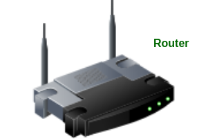

---

## Network Scanning

### What is Network Scanning?
Network scanning is the process of identifying active devices, systems, and services within a network. It is used by network administrators to manage networks and by security professionals to assess security posture.

Network scanning helps to:
- Discover live hosts on a network
- Identify IP addresses and hostnames
- Detect open ports and running services
- Find potential vulnerabilities
- Understand the network topology

Network scanning is an important phase in **network management, troubleshooting, and ethical hacking**.

---

## Types of Network Scanning

  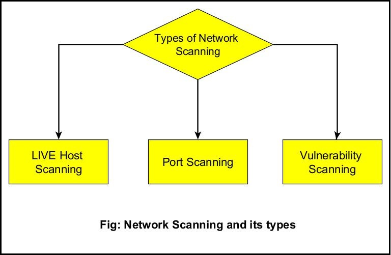

### 1. Network Scanning
Network scanning focuses on identifying **live hosts** within a given IP range. It determines which devices are currently connected and active on the network.

**Purpose:**
- Identify active devices
- Map the network
- Detect unauthorized systems

**Examples:**
- arp-scan
- netdiscover
- fping

---

### 2. Port Scanning
Port scanning is used to identify **open, closed, or filtered ports** on a target system. Each open port may represent a service that could be accessed or exploited.

**Purpose:**
- Identify running services
- Detect vulnerable services
- Strengthen system security

**Common ports scanned:**
- 21 – FTP
- 22 – SSH
- 80 – HTTP
- 443 – HTTPS

**Tools:**
- Nmap
- Netcat
- Angry IP Scanner

---

### 3. Vulnerability Scanning
Vulnerability scanning detects **security weaknesses** in systems, applications, or network devices. It compares system configurations against known vulnerability databases.

**Purpose:**
- Identify security flaws
- Prevent cyber attacks
- Maintain system compliance

**Examples of vulnerabilities:**
- Outdated software
- Weak passwords
- Misconfigured services

**Tools:**
- Nessus
- OpenVAS
- Nikto

---

## Host Name
A host name is a human-readable name assigned to a device on a network to make identification easier than using IP addresses.
- To know the hostname of a machine follow the steps 
- open terminal in parrot os and type
- Command: hostname
- Then you can see the name of your device or virtual machine.

  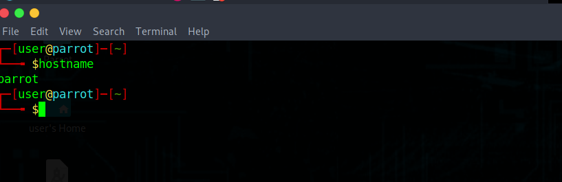

---

## IP Address
An IP (Internet Protocol) address is a unique logical address assigned to a device on a network. It allows devices to locate and communicate with each other.
- To know the ip address of your device simply follow the steps
- open terminal and type the following command
- command: ifconfig

  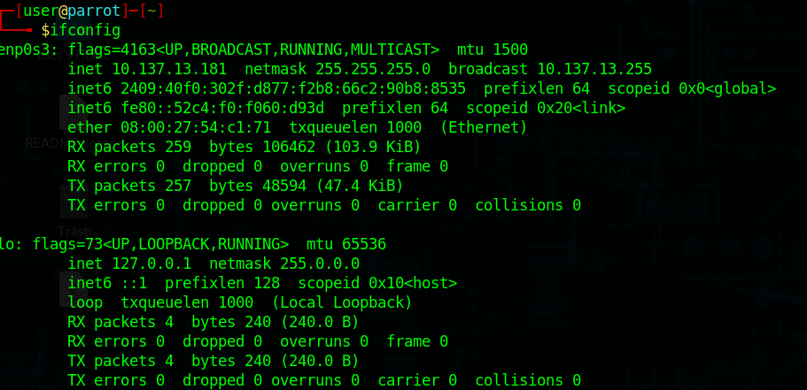

### IPv4
- Fourth version of IP
- Uses 32-bit addresses
- Approximately 4.3 billion addresses

### IPv4 Address Format (Dotted Decimal)
Example:
192.149.252.76

  

### IPv6
- Sixth version of IP
- Uses 128-bit addresses
- Approximately 340 undecillion unique addresses
- Written in hexadecimal format

  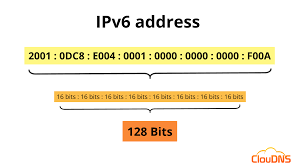

---

## Subnet Mask

### What is a Subnet Mask?
A subnet mask is a 32-bit number used in IPv4 networking to divide an IP address into two parts:
- **Network portion**
- **Host portion**

It helps devices determine whether the destination IP address is on the same network or a different network.

---

### Purpose of Subnet Mask
Subnet masks are used to:
- Identify the network ID and host ID
- Separate large networks into smaller subnetworks
- Reduce network traffic
- Improve network performance and security

---

### How Subnet Mask Works
A subnet mask works by using binary values:
- **1** represents the network part
- **0** represents the host part

  

---

## Private and Public IP Addresses

### Private IP Address
A private IP address is used within a local network and is not accessible directly from the internet.

**Features:**
- Used in LAN (home, office, school)
- Not globally unique
- Cannot access internet directly
- Uses NAT for internet access

**Private IP Ranges:**
- 10.0.0.0 – 10.255.255.255  
- 172.16.0.0 – 172.31.255.255  
- 192.168.0.0 – 192.168.255.255  

### Public IP Address
A public IP address is used to identify a device on the internet and is globally unique.

**Features:**
- Globally unique
- Accessible over the internet
- Assigned by ISP
- Used by servers and websites

---

## ping and fping

### ping
The `ping` command is used to test connectivity between two devices on a network. It sends ICMP echo request packets and waits for a reply to check whether the destination is reachable.

**Uses:**
- Check network connectivity
- Measure response time (latency)
- Troubleshoot network issues

- Command: ping <IP ADDRESS>

  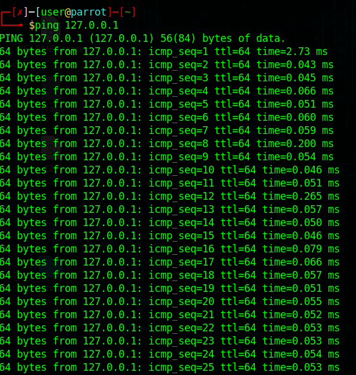

### fping
`fping` is an advanced version of the ping command that allows checking multiple hosts at the same time. It is faster and more suitable for network scanning.

**Uses:**
- Ping multiple IP addresses
- Identify live hosts quickly
- Network monitoring

- Command: fping <IP ADDRESS>

  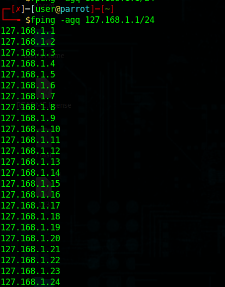

---

## ARP (Address Resolution Protocol)

  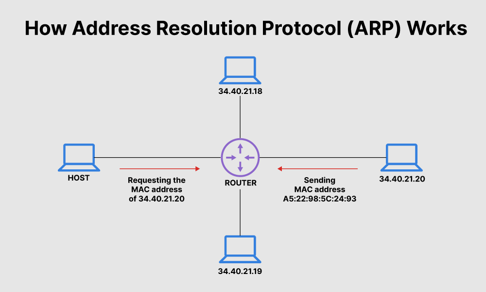

### What is ARP?
ARP is a network protocol used to map an **IP address** to its corresponding **MAC address** within a local network (LAN).

Since devices communicate using MAC addresses at the data link layer, ARP helps in finding the correct MAC address for a given IP address.

---

### Why ARP is Needed
- IP addresses work at the network layer
- MAC addresses work at the data link layer
- ARP acts as a bridge between IP and MAC addresses

---

## ARP Request and ARP Reply

### ARP Request
An ARP Request is a **broadcast message** sent by a device to discover the MAC address of another device with a known IP address in the same local network.

### ARP Reply
An ARP Reply is a **unicast message** sent by the target device containing its MAC address.
- Command: sudo arp-scan <ipaddress>

  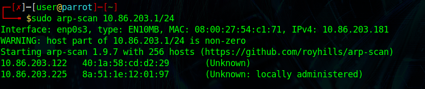

---

## Network Scanning Tools

Network scanning tools are used to discover live hosts, IP addresses, and network details within a network. They are commonly used in network administration and ethical hacking.

---

## Netdiscover

### About Netdiscover
Netdiscover is a **command-line network scanning tool** used to discover live hosts on a local network using **ARP requests**. It is mainly used in LAN environments.

### Features
- Discovers live hosts
- Displays IP and MAC addresses
- Works even when ICMP is blocked
- Useful in passive and active scanning
### How to run in terminal:
- open terminal in parrot os
- type the following command
- Command: netdiscover -r <ipaddress>
- you will see the result as shown in the image

  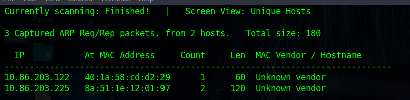

---

## Angry IP Scanner

### About Angry IP Scanner
Angry IP Scanner is a **graphical network scanning tool** used to scan IP ranges and detect live hosts, open ports, and services.

### Features
- Fast IP range scanning
- Detects open ports
- Displays hostname, MAC address, and response time
- User-friendly GUI

### Installing Angry IP Scanner in Parrot OS
- step 1: open firefox browser in os
- step 2: search for angryipscanner
- step 3: open the website and click on download for linux 

  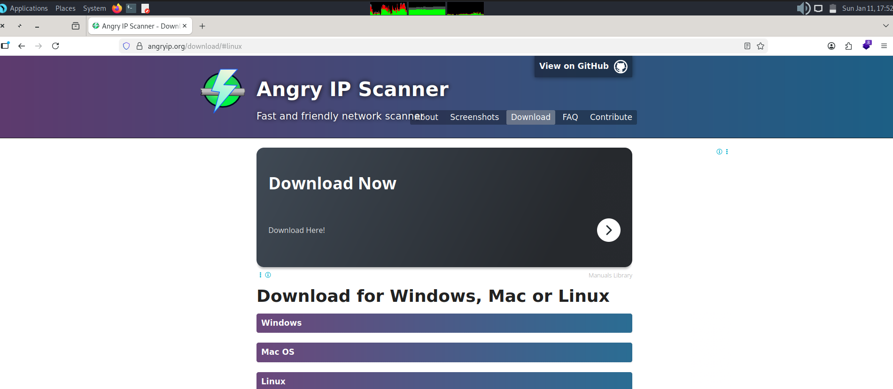

- step 4: launch the tool

  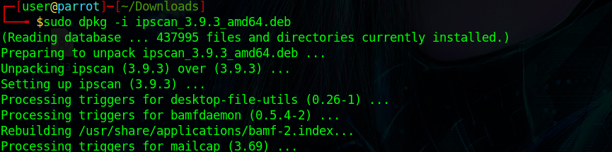

- step 5: open the downloaded file and verify the scanning by giving a ip range.

  

  

---

## Summary:

- A network connects devices to share data, resources, and communication.
- Data is transmitted in small units called packets.
- NIC, protocols, hub, switch, and router are basic networking components.
- Network scanning identifies live hosts, open ports, and services.
- Types of scanning include network, port, and vulnerability scanning.
- IP addresses identify devices; IPv4 and IPv6 are commonly used.
- Subnet masks divide IP addresses into network and host parts.
- Private IPs work in LANs, public IPs work on the internet.

